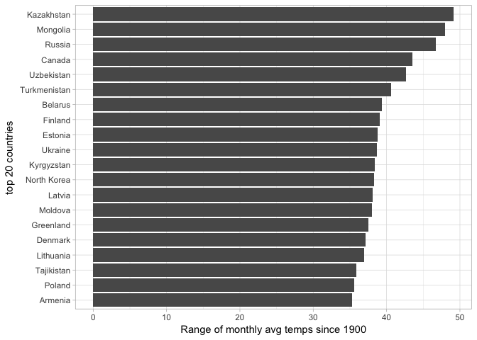

Temperature Analysis
================

-   [Introduction](#introduction)
-   [Analysis](#analysis)

Introduction
------------

The goal of this notebook is to analyse the surface land temperatures of all the countries since 1900. The data is availabe in the .csv format.

Analysis
--------

Let's first start by installing all the required packages.

``` r
# Install a package and load it.
installRequiredPackages <- function(pkg){
  new.pkg <- pkg[!(pkg %in% installed.packages()[,"Package"])]
  if (length(new.pkg))
    install.packages(new.pkg, dependencies = TRUE)
  sapply(pkg, require, character.only = TRUE)
}

libs <- c("dplyr", "ggplot2", "tidyr", "readr")

# Call the function
installRequiredPackages(libs)
```

    ## Loading required package: dplyr

    ## 
    ## Attaching package: 'dplyr'

    ## The following objects are masked from 'package:stats':
    ## 
    ##     filter, lag

    ## The following objects are masked from 'package:base':
    ## 
    ##     intersect, setdiff, setequal, union

    ## Loading required package: ggplot2

    ## Loading required package: tidyr

    ## Loading required package: readr

    ##   dplyr ggplot2   tidyr   readr 
    ##    TRUE    TRUE    TRUE    TRUE

Read in the data set "TEMP.csv"

``` r
# Read in the data set.
temps <- read_csv("TEMP.csv")
```

    ## Parsed with column specification:
    ## cols(
    ##   Date = col_character(),
    ##   `Monthly AverageTemp` = col_double(),
    ##   `Monthly AverageTemp Uncertainty` = col_double(),
    ##   Country = col_character()
    ## )

Display head of temps

``` r
head(temps)
```

    ## # A tibble: 6 × 4
    ##         Date `Monthly AverageTemp` `Monthly AverageTemp Uncertainty`
    ##        <chr>                 <dbl>                             <dbl>
    ## 1 1838-04-01                13.008                             2.586
    ## 2 1838-05-01                    NA                                NA
    ## 3 1838-06-01                23.950                             2.510
    ## 4 1838-07-01                26.877                             2.883
    ## 5 1838-08-01                24.938                             2.992
    ## 6 1838-09-01                18.981                             2.538
    ## # ... with 1 more variables: Country <chr>

Display tail of temps

``` r
tail(temps)
```

    ## # A tibble: 6 × 4
    ##       Date `Monthly AverageTemp` `Monthly AverageTemp Uncertainty`
    ##      <chr>                 <dbl>                             <dbl>
    ## 1 4/1/2013                21.142                             0.495
    ## 2 5/1/2013                19.059                             1.022
    ## 3 6/1/2013                17.613                             0.473
    ## 4 7/1/2013                17.000                             0.453
    ## 5 8/1/2013                19.759                             0.717
    ## 6 9/1/2013                    NA                                NA
    ## # ... with 1 more variables: Country <chr>

The `Date` column contains dates in 2 formats `yyyy-mm-dd` and `mm/dd/yyyy`. Upon examination, it is found that all the dates from 1900 are in the format `mm/dd/yyyy`, which makes our job a little easy, since we are looking to analyse temperatures from 1900.

When reading in the date values, we can mention the format as `%m/%d/%Y`. This format will cause in to read the dates which are in `mm/dd/yyyy` format by their value and the other dates which are not in this format will have `NAs`.

``` r
# Use "%m/%d/%Y" format for dates starting from 1900, remaining will be NA's.
temps$Date <- as.Date(temps$Date, format = "%m/%d/%Y")
```

The `Country` column is in character format, we need to convert this into a factor to be able to use it in ggplot graphs.

``` r
# Convert the Country column to factor
temps$Country <- as.factor(temps$Country)
```

Now comes the interesting part, we will first remove all observations for which the Date column has NA's - thus keeping observations starting from 1900. Next group by the Country column, then use an aggregate function, then mutate the columns if necessary, then arrange the columns based the mutated value.

Here, we are calculating the range of temperatures, i.e, max(Monthly AverageTemp) - min(Monthly AverageTemp) for each country. This will show us the countries which had the highest range of surface temperatures recorded since 1900.

The classic idiom: filter -&gt; group\_by -&gt; summarise -&gt; mutate -&gt; arrange

``` r
# remove na's
# group observations by country
# calculate tempDiff = maxTemp - minTemp
# arrange in descending order of tempDiff
tempsDiff <- temps %>%
  filter(!is.na(`Monthly AverageTemp`),
         !is.na(Date)) %>%
  group_by(Country) %>%
  summarise(minTemp = min(`Monthly AverageTemp`),
            maxTemp = max(`Monthly AverageTemp`)) %>%
  mutate(tempDiff = maxTemp - minTemp) %>%
  arrange(desc(tempDiff))
```

For brevity's sake, we will show only the top 20 countries with the highest range of surface tempeartures recorded since 1900.

``` r
top20 <- head(tempsDiff, 20)
```

Next, tell ggplot2 that Country is an ordered factor, and its levels are ordered based on the tempDiff.

``` r
# Tell ggplot that it is an ordered factor, and order them based on tempDiff
top20$Country <- factor(top20$Country, levels=top20$Country[order(top20$tempDiff)])
```

Plot it

``` r
# Plot top 20 countries and their temp differences
ggplot(top20, aes(x=Country, y=tempDiff)) +
  geom_bar(stat="identity") +
  labs(x = "top 20 countries", y ="Range of monthly avg temps since 1900") +
  coord_flip() +
  theme_light()
```



Now lets try answer the following question: "Which year had the highest change of surface temperature in United States since 1900 ?"

To answer this, we first need to subset the dataset to contain only US data.

``` r
# Extract US data from temps
UStemps <- temps %>%
  filter(!is.na(`Monthly AverageTemp`),
         !is.na(Date),
         Country == "United States")
```

For conveinience sake, lets add a new column to this data set which contains the surface monthly average temperature in degrees Fahrenhiet.

``` r
# Create a new column for Fahrenheit temp
UStemps <- UStemps %>%
  mutate(`Monthly AverageTemp F` = (`Monthly AverageTemp` * (9/5)) + 32)
```

The original dataset contains monthly average temperatures, from this, we need to calculate the yearly average temperatures. That is, yearly average temperatures from 1900 - 2013.

We can do this by splitting the Date column into Year, Month, Day columns and then grouping the observations by Year. We can drop the Month and Day as they are no longer needed.

``` r
# Divide the Date column using the separate function of tidyr into Year, Month, Day
# group observations by year.
# calculate yearly avg temp in degrees C and degrees F
UStempsYearly <- UStemps %>%
  separate(Date, c("Year", "Month", "Day")) %>%
  select(-Month, -Day) %>%
  group_by(Year) %>%
  summarise(YearlyAvgTempC = mean(`Monthly AverageTemp`),
            YearlyAvgTempF = mean(`Monthly AverageTemp F`))
```

Plot it

``` r
# Plot showing the average land temperature by year
ggplot(UStempsYearly, aes(x=as.numeric(Year), y=YearlyAvgTempF)) + 
  geom_point() +
  labs(x = "Year", y = "Average land temp in Fahrenheit") +
  geom_smooth()
```

    ## `geom_smooth()` using method = 'loess'


A step graph

``` r
#Plot UStempsYearly
ggplot(UStempsYearly, aes(x=as.numeric(Year), y=YearlyAvgTempF)) + 
  geom_step() +
  labs(x = "Year", y = "Average land temp in Fahrenheit") +
  geom_smooth(col="red", se=F)
```

    ## `geom_smooth()` using method = 'loess'


Calculate the one year differences

``` r
# Calculate the one year difference of average land temperature by year and 
# provide the maximum difference (value) with corresponding years.

# Get the year and temperature into a vectors
# Initialize variables
years <- UStempsYearly$Year
avgTemp <- UStempsYearly$YearlyAvgTempF
diffyears <- numeric(length(years))
timePeriod <- character(length(years))

# Loop over and build the vectors
for (i in 1:length(years)){
  timePeriod[i] = paste0(years[i+1], "-", years[i])
  diffyears[i] = avgTemp[i+1] - avgTemp[i]
}

# round to 2 digits which will help in displaying
diffyears <- round(diffyears, digits = 2)

# build the dataframe
oneYearDiff <- data_frame(timePeriod, diffyears)

# sort based on absoulte value
sortedOneYearDiff <- oneYearDiff %>%
  filter(!is.na(diffyears)) %>%
  arrange(desc(abs(diffyears)))

# extract top 20 time periods
top20OneYearDiff <- head(sortedOneYearDiff, 20)

# Tell ggplot that it is an ordered factor, and order them based on diffyears
top20OneYearDiff$timePeriod <- factor(top20OneYearDiff$timePeriod, 
                                      levels=top20OneYearDiff$timePeriod[order(top20OneYearDiff$diffyears)])

# Create a lollipop chart showing the top 20 time periods with max diff of temps
ggplot(top20OneYearDiff, aes(x = timePeriod, y=diffyears, label=diffyears)) +
  geom_point(stat='identity', color="black", size=8) +
  geom_segment(aes(y=0,
                   x=timePeriod,
                   yend=diffyears,
                   xend=timePeriod), color = "black") +
  geom_text(color="white", size=2.5) +
  labs(x = "Time Period", y = "Difference of avg temperature") +
  ylim(-3.0, 3.0) +
  coord_flip() +
  theme_grey()
```


