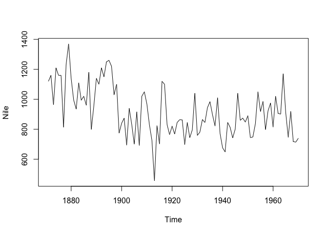
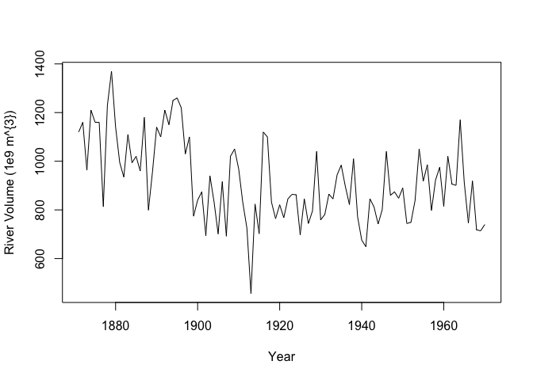
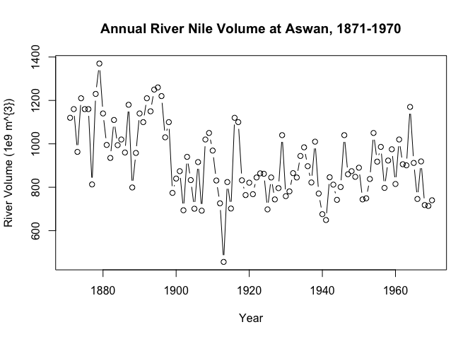
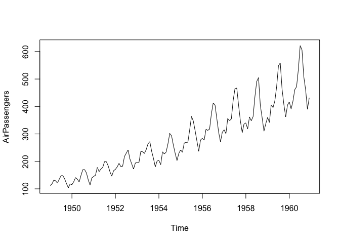
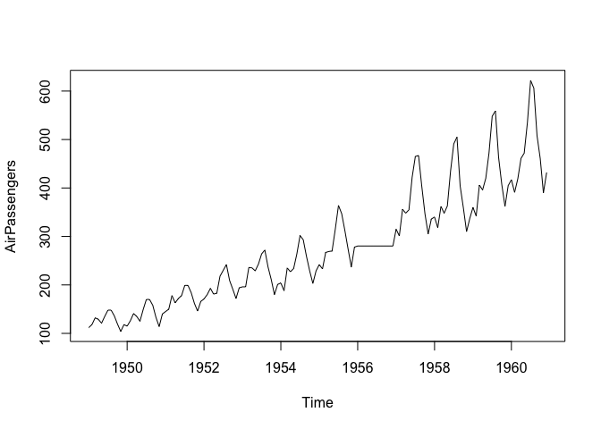
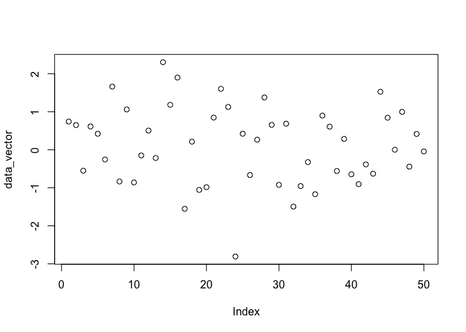
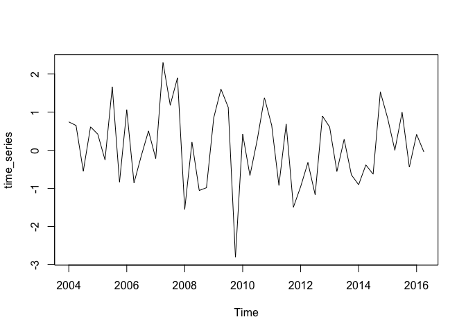
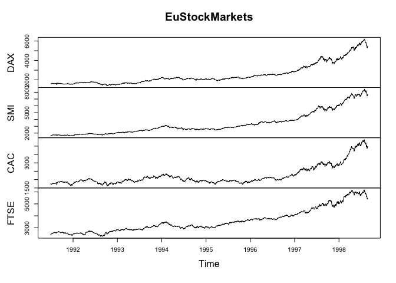
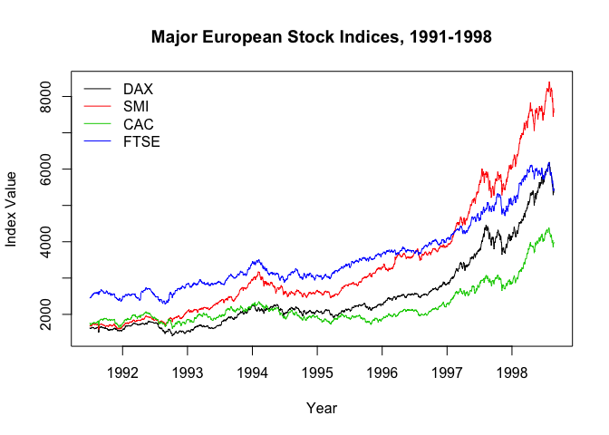

Intro to time series in R
================
Shravan Kuchkula

-   [Exploring raw time series:](#exploring-raw-time-series)
-   [Basic time series plot](#basic-time-series-plot)
-   [Missing Values in Time Series](#missing-values-in-time-series)
-   [Basic Time Series objects](#basic-time-series-objects)
-   [Testing whether an object is a time series](#testing-whether-an-object-is-a-time-series)
-   [Plot a time series object](#plot-a-time-series-object)

In this notebook, we will learn to use R for time series analysis and forecasting. We will also learn, basic `time series models` :

-   **White Noise (WN)**
-   **Random Walk (RW)**
-   **Autoregression (AR)**
-   **Simple Moving Average (MA)**

Exploring raw time series:
--------------------------

The most common first step when conducting time series analysis is to display your time series dataset in a visually intuitive format. The most useful way to view raw time series data in R is to use the `print()` command, which displays the Start, End, and Frequency of your data along with the observations.

Here, we will use the `Nile` dataset which is part of the `datasets` package, which is loaded by default.

``` r
print(Nile)
```

    ## Time Series:
    ## Start = 1871 
    ## End = 1970 
    ## Frequency = 1 
    ##   [1] 1120 1160  963 1210 1160 1160  813 1230 1370 1140  995  935 1110  994
    ##  [15] 1020  960 1180  799  958 1140 1100 1210 1150 1250 1260 1220 1030 1100
    ##  [29]  774  840  874  694  940  833  701  916  692 1020 1050  969  831  726
    ##  [43]  456  824  702 1120 1100  832  764  821  768  845  864  862  698  845
    ##  [57]  744  796 1040  759  781  865  845  944  984  897  822 1010  771  676
    ##  [71]  649  846  812  742  801 1040  860  874  848  890  744  749  838 1050
    ##  [85]  918  986  797  923  975  815 1020  906  901 1170  912  746  919  718
    ##  [99]  714  740

Another useful command for viewing time series data in R is the `length()` function, which tells you the total number of observations in your data.

``` r
# List the number of observations in the Nile dataset
length(Nile)
```

    ## [1] 100

Basic time series plot
----------------------

While simple commands such as print(), length(), head(), and tail() provide crucial information about your time series data, another very useful way to explore any data is to generate a plot.

In this exercise, you will plot the River Nile annual streamflow data using the plot() function. For time series data objects such as Nile, a Time index for the horizontal axis is typically included. From the previous exercise, you know that this data spans from 1871 to 1970, and horizontal tick marks are labeled as such. The default label of "Time" is not very informative. Since these data are annual measurements, you should use the label "Year". While you're at it, you should change the vertical axis label to "River Volume (1e9 m^{3})".

Additionally, it helps to have an informative title, which can be set using the argument main. For your purposes, a useful title for this figure would be "Annual River Nile Volume at Aswan, 1871-1970".

Finally, the default plotting type for time series objects is "l" for line. Connecting consecutive observations can help make a time series plot more interpretable. Sometimes it is also useful to include both the observations points as well as the lines, and we instead use "b" for both.

``` r
# Plot the Nile data
plot(Nile)
```



``` r
# Plot the Nile data with xlab and ylab arguments
plot(Nile, xlab = "Year", ylab = "River Volume (1e9 m^{3})")
```



``` r
# Plot the Nile data with xlab, ylab, main, and type arguments

plot(Nile, xlab = "Year", ylab = "River Volume (1e9 m^{3})", main = "Annual River Nile Volume at Aswan, 1871-1970", type="b")
```



In addition to viewing your data and plotting over time, there are several additional operations that can be performed on time series datasets.

The `start()` and `end()` functions return the time index of the first and last observations, respectively. The `time()` function calculates a vector of time indices, with one element for each time index on which the series was observed.

The `deltat()` function returns the fixed time interval between observations and the `frequency()` function returns the number of observations per unit time. Finally, the `cycle()` function returns the position in the cycle of each observation.

``` r
# Plot AirPassengers
plot(AirPassengers)
```


``` r
# View the start and end dates of AirPassengers
start(AirPassengers)
```

    ## [1] 1949    1

``` r
end(AirPassengers)
```

    ## [1] 1960   12

`time` function:

``` r
time(AirPassengers)
```

    ##           Jan      Feb      Mar      Apr      May      Jun      Jul
    ## 1949 1949.000 1949.083 1949.167 1949.250 1949.333 1949.417 1949.500
    ## 1950 1950.000 1950.083 1950.167 1950.250 1950.333 1950.417 1950.500
    ## 1951 1951.000 1951.083 1951.167 1951.250 1951.333 1951.417 1951.500
    ## 1952 1952.000 1952.083 1952.167 1952.250 1952.333 1952.417 1952.500
    ## 1953 1953.000 1953.083 1953.167 1953.250 1953.333 1953.417 1953.500
    ## 1954 1954.000 1954.083 1954.167 1954.250 1954.333 1954.417 1954.500
    ## 1955 1955.000 1955.083 1955.167 1955.250 1955.333 1955.417 1955.500
    ## 1956 1956.000 1956.083 1956.167 1956.250 1956.333 1956.417 1956.500
    ## 1957 1957.000 1957.083 1957.167 1957.250 1957.333 1957.417 1957.500
    ## 1958 1958.000 1958.083 1958.167 1958.250 1958.333 1958.417 1958.500
    ## 1959 1959.000 1959.083 1959.167 1959.250 1959.333 1959.417 1959.500
    ## 1960 1960.000 1960.083 1960.167 1960.250 1960.333 1960.417 1960.500
    ##           Aug      Sep      Oct      Nov      Dec
    ## 1949 1949.583 1949.667 1949.750 1949.833 1949.917
    ## 1950 1950.583 1950.667 1950.750 1950.833 1950.917
    ## 1951 1951.583 1951.667 1951.750 1951.833 1951.917
    ## 1952 1952.583 1952.667 1952.750 1952.833 1952.917
    ## 1953 1953.583 1953.667 1953.750 1953.833 1953.917
    ## 1954 1954.583 1954.667 1954.750 1954.833 1954.917
    ## 1955 1955.583 1955.667 1955.750 1955.833 1955.917
    ## 1956 1956.583 1956.667 1956.750 1956.833 1956.917
    ## 1957 1957.583 1957.667 1957.750 1957.833 1957.917
    ## 1958 1958.583 1958.667 1958.750 1958.833 1958.917
    ## 1959 1959.583 1959.667 1959.750 1959.833 1959.917
    ## 1960 1960.583 1960.667 1960.750 1960.833 1960.917

`deltat` function

``` r
deltat(AirPassengers)
```

    ## [1] 0.08333333

`frequency` function

``` r
frequency(AirPassengers)
```

    ## [1] 12

`cycle` function

``` r
cycle(AirPassengers)
```

    ##      Jan Feb Mar Apr May Jun Jul Aug Sep Oct Nov Dec
    ## 1949   1   2   3   4   5   6   7   8   9  10  11  12
    ## 1950   1   2   3   4   5   6   7   8   9  10  11  12
    ## 1951   1   2   3   4   5   6   7   8   9  10  11  12
    ## 1952   1   2   3   4   5   6   7   8   9  10  11  12
    ## 1953   1   2   3   4   5   6   7   8   9  10  11  12
    ## 1954   1   2   3   4   5   6   7   8   9  10  11  12
    ## 1955   1   2   3   4   5   6   7   8   9  10  11  12
    ## 1956   1   2   3   4   5   6   7   8   9  10  11  12
    ## 1957   1   2   3   4   5   6   7   8   9  10  11  12
    ## 1958   1   2   3   4   5   6   7   8   9  10  11  12
    ## 1959   1   2   3   4   5   6   7   8   9  10  11  12
    ## 1960   1   2   3   4   5   6   7   8   9  10  11  12

> These commands provide considerable descriptive information about the structures and patterns in your time series data. It may help to keep these commands handy when working with your own time series data.

Missing Values in Time Series
-----------------------------

Sometimes there are missing values in time series data, denoted NA in R, and it is useful to know their locations. It is also important to know how missing values are handled by various R functions. Sometimes we may want to ignore any missingness, but other times we may wish to impute or estimate the missing values.

Let's again consider the monthly AirPassengers dataset, but now the data for the year 1956 are missing. In this exercise, you'll explore the implications of this missing data and impute some new data to solve the problem.

The mean() function calculates the sample mean, but it fails in the presence of any NA values. Use mean(\_\_\_, na.rm = TRUE) to calculate the mean with all missing values removed. It is common to replace missing values with the mean of the observed values. Does this simple data imputation scheme appear adequate when applied the the AirPassengers dataset?

``` r
# Plot the AirPassengers data
plot(AirPassengers)
```



Impute the missing values with the mean

``` r
# Compute the mean of AirPassengers
mean(AirPassengers)
```

    ## [1] 280.2986

``` r
# Impute mean values to NA in AirPassengers
AirPassengers[85:96] <- mean(AirPassengers, na.rm = TRUE)

# Generate another plot of AirPassengers
plot(AirPassengers)
```



Based on your plot, it seems that simple data imputation using the mean is not a great method to approximate what's really going on in the AirPassengers data.

Basic Time Series objects
-------------------------

The function `ts()` can be applied to create time series objects. A time series object is a vector (univariate) or matrix (multivariate) with additional attributes, including time indices for each observation, the sampling frequency and time increment between observations, and the cycle length for periodic data. Such objects are of the ts class, and represent data that has been observed at (approximately) equally spaced time points.

> The advantage of creating and working with time series objects of the ts class is that many methods are available for utilizing time series attributes, such as time index information. For example, as you've seen in earlier exercises, calling plot() on a ts object will automatically generate a plot over time.

In this exercise, you'll familiarize yourself with the ts class by encoding some time series data (saved as data\_vector) into ts and exploring the result.

Your time series data\_vector starts in the year 2004 and has 4 observations per year (i.e. it is quarterly data).

``` r
# Create a data_vector
data_vector <- rnorm(50, mean=0, sd=1)

# Use plot() to view data_vector
plot(data_vector)
```



``` r
# Convert data_vector to a ts object with start = 2004 and frequency = 4
time_series <- ts(data_vector, start=2004, frequency=4)

# Use print() and plot() to view time_series
print(time_series)
```

    ##              Qtr1         Qtr2         Qtr3         Qtr4
    ## 2004  0.743698616  0.650483697 -0.549463921  0.614620235
    ## 2005  0.421735141 -0.254795462  1.662480519 -0.834424112
    ## 2006  1.061306053 -0.858365904 -0.148774920  0.506224569
    ## 2007 -0.216096347  2.304365775  1.183649037  1.900907686
    ## 2008 -1.551790996  0.213915523 -1.055258252 -0.982411685
    ## 2009  0.847813209  1.604196648  1.127668966 -2.807555118
    ## 2010  0.422637700 -0.664534383  0.266583725  1.377414150
    ## 2011  0.655735601 -0.922250483  0.687877429 -1.493794282
    ## 2012 -0.953989754 -0.323260376 -1.168785456  0.899702844
    ## 2013  0.608894494 -0.557596649  0.287611220 -0.645051171
    ## 2014 -0.904093933 -0.384219441 -0.628719417  1.527685546
    ## 2015  0.844095050  0.001943898  0.997406667 -0.442893954
    ## 2016  0.416358564 -0.043334216

``` r
plot(time_series)
```



> Great! As you can see, ts objects are treated differently by commands such as print() and plot(). For example, automatic use of the time-index in your calls to plot() requires a ts object.

Testing whether an object is a time series
------------------------------------------

When you work to create your own datasets, you can build them as ts objects. Recall the dataset data\_vector from the previous exercise, which was just a vector of numbers, and time\_series, the ts object you created from data\_vector using the ts() function and information regarding the start time and the observation frequency.

When you use datasets from others, such as those included in an R package, you can check whether they are ts objects using the is.ts() command. The result of the test is either TRUE when the data is of the ts class, or FALSE if it is not.

``` r
# Check whether data_vector and time_series are ts objects
is.ts(data_vector)
```

    ## [1] FALSE

``` r
is.ts(time_series)
```

    ## [1] TRUE

``` r
# Check whether Nile is a ts object
is.ts(Nile)
```

    ## [1] TRUE

``` r
# Check whether AirPassengers is a ts object
is.ts(AirPassengers)
```

    ## [1] TRUE

Well done! is.ts() is a simple command for determining whether or not you're working with a ts object. As you can see, the Nile and AirPassengers datasets you worked with earlier in the chapter are both encoded as ts objects.

Plot a time series object
-------------------------

It is often very useful to plot data we are analyzing, as is the case when conducting time series analysis. If the dataset under study is of the ts class, then the plot() function has methods that automatically incorporate time index information into a figure.

Let's consider the **eu\_stocks** dataset (available in R by default as EuStockMarkets). This dataset contains daily closing prices of major European stock indices from 1991-1998, specifically, from Germany (DAX), Switzerland (SMI), France (CAC), and the UK (FTSE). The data were observed when the markets were open, so there are no observations on weekends and holidays. We will proceed with the approximation that this dataset has evenly spaced observations and is a four dimensional time series.

``` r
# Check whether eu_stocks is a ts object
is.ts(EuStockMarkets)
```

    ## [1] TRUE

``` r
# View the start, end, and frequency of eu_stocks
start(EuStockMarkets)
```

    ## [1] 1991  130

``` r
end(EuStockMarkets)
```

    ## [1] 1998  169

``` r
frequency(EuStockMarkets)
```

    ## [1] 260

``` r
# Generate a simple plot of eu_stocks
plot(EuStockMarkets)
```



``` r
# Use ts.plot with eu_stocks
ts.plot(EuStockMarkets, col = 1:4, xlab = "Year", ylab = "Index Value", main = "Major European Stock Indices, 1991-1998")

# Add a legend to your ts.plot
legend("topleft", colnames(EuStockMarkets), lty = 1, col = 1:4, bty = "n")
```



> Congratulations! You've mastered the basics of the ts class in R, including encoding ts objects, viewing basic time series qualities, and plotting time series data. Now let's move on to the next chapter! You have finished the chapter "Exploratory time series data analysis"!
